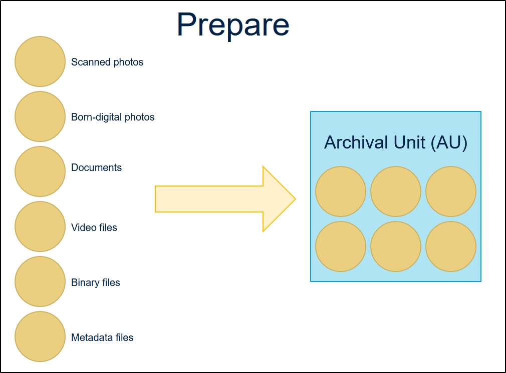
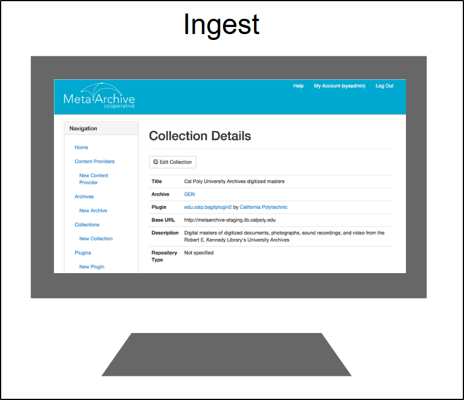
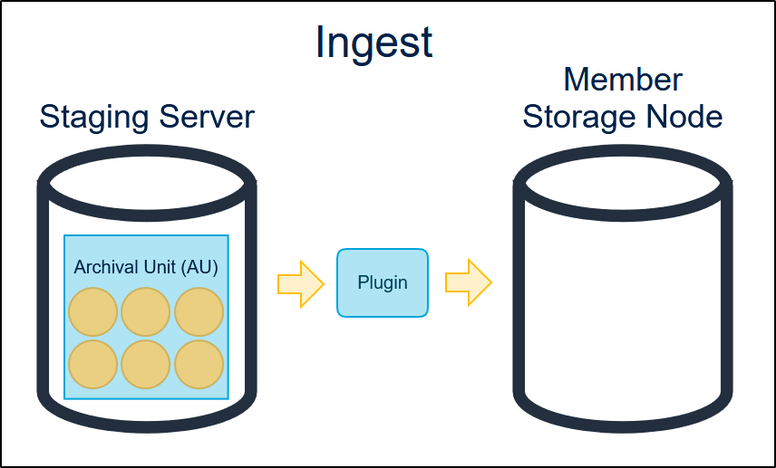
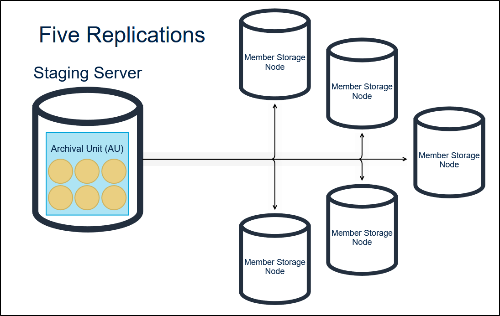
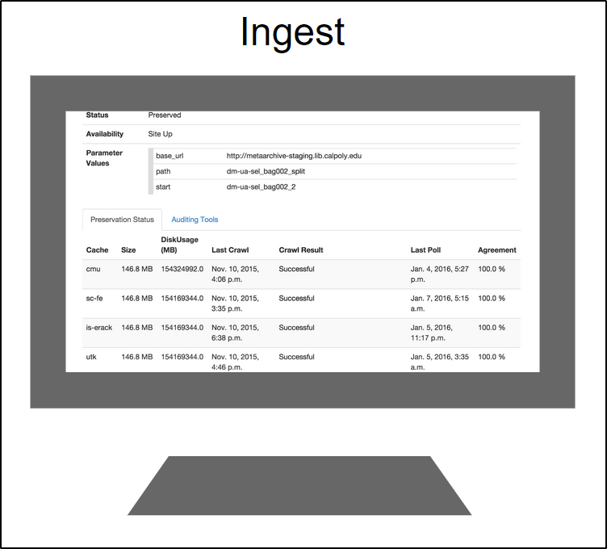
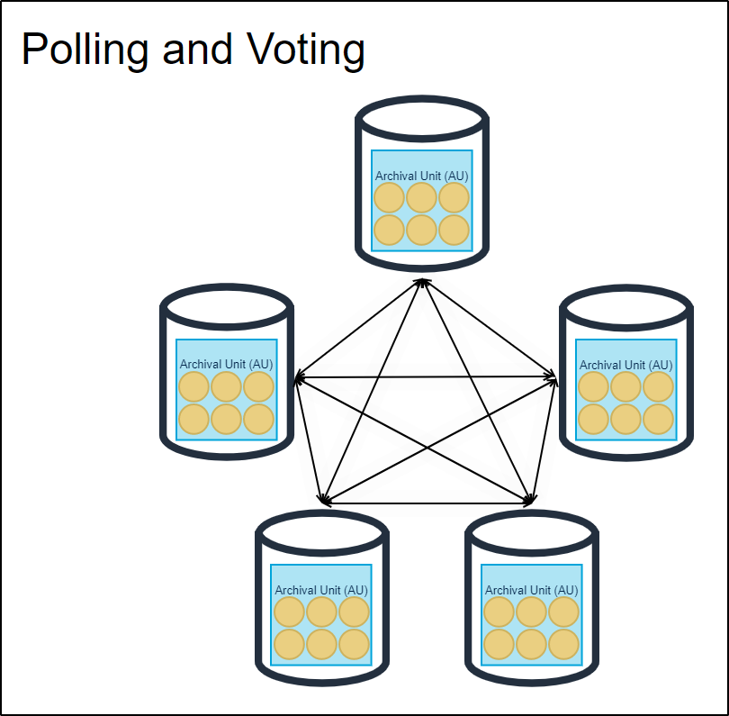
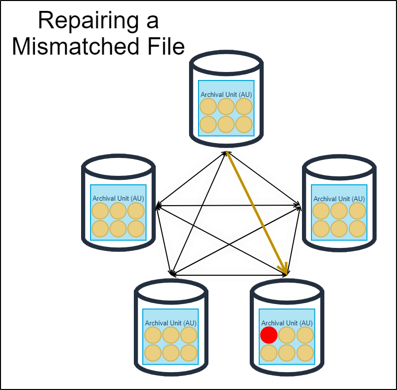

How MetaArchive Works
=====================

* 1 [MetaArchive In a Nut Shell](#HowMetaArchiveWorks-trueMetaArchiveInaNutShell)
	+ 1.1 [The Steps of Preservation with MetaArchive](#HowMetaArchiveWorks-TheStepsofPreservationwithMetaArchive)
		- 1.1.1 [Phase 1: Preparing Content](#HowMetaArchiveWorks-Phase1:PreparingContent)
		- 1.1.2 [Phase 2: Configuring the MetaArchive Network to Ingest Content](#HowMetaArchiveWorks-Phase2:ConfiguringtheMetaArchiveNetworktoIngestContent)
		- 1.1.3 [Phase 3: Ingesting Content](#HowMetaArchiveWorks-Phase3:IngestingContent)
		- 1.1.4 [Phase 4: Preserving Content](#HowMetaArchiveWorks-Phase4:PreservingContent)
		- 1.1.5 [Phase 5: Restoration of Content](#HowMetaArchiveWorks-Phase5:RestorationofContent)

MetaArchive In a Nut Shell
======================================================================================================================================================================================================================================================================================================================================================================================================================================================================================================================================================================================================================================================================================================================================================

MetaArchive uses the free open source  [LOCKSS](/public-documentation/MetaArchive Cooperative/Knowledge Base/LOCKSS) archiving software to operate a network of preservation servers. Due to the low cost participation it is affordable for libraries of all sizes. LOCKSS is an ACM award winning digital preservation technology which preserves all formats and genres of web-published content from full fledged web sites to simple web hosted directories.

Content is stored in and restored to its original format. Participating institutions identify valuable digital assets that they wish to preserve safely. They make the corresponding digital content accessible to MetaArchive network servers, so-called LOCKSS caches, which are configured to copy content, update it to its latest versions on a regular basis, and ensure its integrity over time.

All content is stored in multiple copies on multiple caches at geographically dispersed locations. The MetaArchive network manages the number of replication so that a loss of all copies becomes extremely unlikely. If an institution loses preserved content for whatever reason its content is restored in its original form.

The Steps of Preservation with MetaArchive
------------------------------------------

### Phase 1: Preparing Content

For some collections Content Preparation is very easy. In other cases some more effort may be necessary. For the more technically interested, [Content Preparation](https://wiki.metaarchive.org/metawiki/index.php/DDPContentPreparation "DDPContentPreparation") covers content issues related to specific web server configurations and hosting scenarios. [Ingest Procedures Overview](https://wiki.metaarchive.org/metawiki/index.php/MetaArchive_Ingest_Procedures_Overview "MetaArchive Ingest Procedures Overview") provides an even more practical set-by-step walkthrough of the final stages of content preparation (plugin development, manifest pages, Conspectus entries, etc.). A general outline follows for the average reader.

1. A **Content Owner** identifies valuable digital content that needs to be safely preserved, for example:
	* electronic theses and dissertations
	* data sets
	* image masters
	* journals
	* other
2. The **Content Owner** prepares (or stages) content for preservation by:
	* making content accessible in a firewalled web hosted directory;
	* organizing content so that document files and metadata can be harvested together by LOCKSS caches; and
	* discussing with the MetaArchive central staff, when needed, how to harvest content files and METS/OAI metadata from a database backed institutional repository (ContentDM, DSPACE, homegrown, etc.)
3. The **Content Owner** prepares a collection description in the MetaArchive's Conspectus tool:
	* gives the collection a title and archive designation;
	* enters the source URL (base\_url) for the web hosted directory (see above); and
	* provides some descriptive metadata for the collection
4. A **Technical Person** reviews the prepared (or staged) content, by:
	* planning the crawl procedure used by LOCKSS caches when ingesting/updating content;
	* tailors this procedure to the web site being crawled (i.e., defines Plugin crawl rules), for example:
		+ defines rules to ignore links to ephemeral information such as 'Recent Announcements', 'Lastest News', etc.; and
		+ defines rules to include all intended files (e.g., tiffs) but exclude all unintended files (e.g., low res jpgs)
	* planning how to organize contents so that LOCKSS caches archive big collections in manageable archival units (generally between 1GB-30GB)
	* making sure that the harvesting procedure will guide LOCKSS caches to copy all content needed to restore the collection in the event of total loss of the originals

Member institutions prepare content for preservation, producing packages of content according to their local needs and workflows.

  

### Phase 2: Configuring the MetaArchive Network to Ingest Content

Phase 2 starts once the **Content Owner** and the **Tech Person** agree that the approach taken will preserve the intended content. This happens when:

1. The **Tech Person** publicizes the crawl procedure in the MetaArchive code repository;
2. The **Tech Person** and/or **Content Owner** enters configuration parameters for the content that is now available for preservation in the MetaArchive Conspectus tool; and
3. The **MetaArchive Central Staff** adds the configuration parameters to the MetaArchive title database

### Phase 3: Ingesting Content

Ingest of the new content becomes possible once MetaArchive servers have noticed the new configuration settings. This happens when:

1. The **MetaArchive Central Staff** assigns the LOCKSS caches that are to preserve the new content;
	1. Decisions are guided by the goal to replicate all content 7 times, thus seven caches are identified;
	2. Chosen caches need to have sufficient disc space to store content; and
	3. Caches chosen are geographically dispersed
2. A **Tech Person** at each assigned location adds the identified content to his/her caches configuration; and
3. The **LOCKSS software** starts to take care of the new content along with other preserved content.

Member creates entry in the MetaArchive [Conspectus](/public-documentation/MetaArchive Cooperative/Knowledge Base/Conspectus), describing the collection(s) it is submitting for ingest.

  

Member makes content available to network via web “staging” server.

  

Five member storage nodes are assigned to ingest the new content.

### Phase 4: Preserving Content

1. The **LOCKSS software** running on each cache executes its processes on a routine schedule by:
	* harvesting content through the Internet from the url locations given in its configuration;
	* including all content that pass through the crawl rules defined for the collections;
	* initiating polls about the make up of preserved content with other LOCKSS caches in the network;
	* voting in polls initiated by peers; and
	* repairing content if a poll result shows convincingly that contents stored locally is inconsistent with the copies held by the majority of caches (memory failure can lead to such a situation)
	1. helping other caches to repair content;
2. The **MetaArchive Central Staff** uses the Cache Manager and Conspectus tools to monitor the network status to insure that:
	* content is replicated sufficiently; and
	* the network operates correctly
3. The **Content Owner** revisits Phase 1 decisions and solutions whenever content structure changes; and
4. The **Content Owner** and **Tech Person** regularly audit content as it is preserved on caches to insure that the harvesting procedures put in place guide the LOCKSS caches correctly when ingesting and updating content (If not please go back to Phase 1, Step 4)

Members can monitor progress and completion of ingest process via the Conspectus.

  

After ingest, storage nodes regularly and iteratively check in with each other (called "polling and voting") to make sure that all five copies of the content remain identical over time.

  

If a mismatch is detected between two nodes, the servers determine regarding which copies are correct and which do not match, and then the network repairs the corrupted files and records that action.

  

### Phase 5: Restoration of Content

If the original data is lost:

1. The **MetaArchive Central Staff** helps the institution to identify caches where their content is replicated; and
2. The **Tech Staff** use the proxy feature of one of these caches to restore preserved content

Member alerts the network administrator via email and requests a preserved copy.

Network administrator retrieves a copy from the network and makes it available via download to member institution.

In case of a local disaster or hardware failure, members can contact the network administrator to set up a replacement server and recover the content from the MetaArchive.

  

