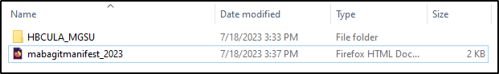

LOCKSS requires the inclusion of an **HTML Manifest Page** for each AU in the LOCKSS system.  This page records:

* Information about the content of the AU
* Contact information for the AU
* Permission for the LOCKSS daemons to crawl and harvest the content

This manifest page should be placed in the top-level directory (i.e., the base\_url):

It does not need to contain links to archival units like most standard manifest pages.  The template can be found here: <https://github.com/MetaArchive/educopia/blob/master/manifestpages/mabagitmanifest.html>

Here's an example of what a filled out HTML Manifest Page looks:

\_\_\_\_\_\_\_\_\_\_\_\_\_\_\_\_\_\_\_\_\_\_\_\_\_\_\_\_\_\_\_\_\_\_\_\_\_\_\_\_\_\_\_\_\_\_\_\_\_\_\_\_\_\_\_\_\_\_\_\_\_\_

HBCU Library Alliance - Morgan State University
===============================================

###  Manifest Page to allow preservation by LOCKSS daemons in the MetaArchive Network  LOCKSS system has permission to collect, preserve, and serve this Archival Unit.

Collection Info:

* Conspectus Collection(s): Morgan State University
* Source-Organization: AUC Woodruff Library as technical support for HBCU Library Alliance
* Contact-Name: Christine Wiseman
* Contact-Phone: +1-404-978-2038
* Contact-Email: [cwiseman@auctr.edu](mailto:cwiseman@auctr.edu)
* Organization-Address: 111 James P. Brawley Dr. Atlanta, GA 30314

  

Contact GitHub API Training Shop Blog About © 2017 GitHub, Inc. Terms Privacy Security Status Help

  

\_\_\_\_\_\_\_\_\_\_\_\_\_\_\_\_\_\_\_\_\_\_\_\_\_\_\_\_\_\_\_\_\_\_\_\_\_\_\_\_\_\_\_\_\_\_\_\_\_\_\_\_\_\_\_\_\_\_\_\_\_\_\_\_

