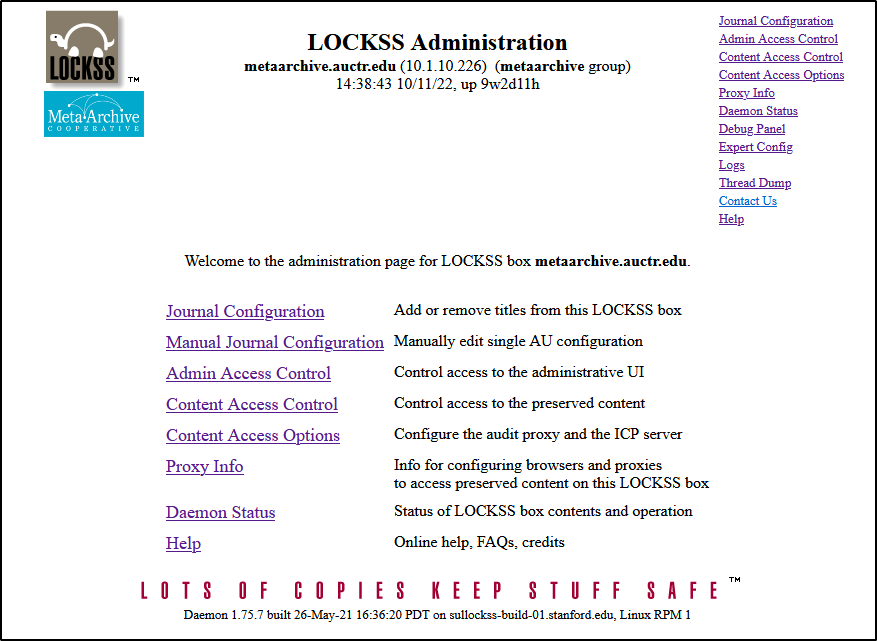

LOCKSS
======

*** 1 [LOCKSS Daemon](#LOCKSS-LOCKSSDaemon)

LOCKSS** ("Lots of Copies Keep Stuff Safe") is an open source software program that runs a peer-to-peer network allowing institutions to collect, describe, and preserve access to files. Its main goal is distributed, decentralized digital preservation.   LOCKSS was originally designed for scholarly journals, but is now also used for a range of other materials.

* Core support for the LOCKSS software is provided by Stanford University Libraries (see <https://www.lockss.org/>).
* See the LOCKSS documentation portal at <https://lockss.github.io/>.
* See the LOCKSS Community Wiki at <https://github.com/lockss/community/wiki>
* See the Cross-[PLN](/public-documentation/MetaArchive Cooperative/Knowledge Base/PLN - Private LOCKSS Network) Technical Working Group shared code repository at: <https://github.com/Cross-PLN-Technical-Working-Group>

A **LOCKSS network** is a network of LOCKSS caches that are maintained with a common title database  

LOCKSS Daemon
=============

The LOCKSS Daemon is the core LOCKSS software program.  A *daemon* is a computer program that runs as a background process, rather than being under the direct control of an interactive user.

Administrators can use the **LOCKSS Administration** [GUI](https://en.wikipedia.org/wiki/Graphical_user_interface) to interact with their local LOCKSS box.

Available from the center or right-side menu:

* **Journal Configuration** -
	+ Add AUs -
	+ Remove AUs -
	+ Deactivate AUs -
	+ Reactivate AUs -
	+ Backup -
	+ Restore -
	+ Manual Add/Edit -
* **Manual Journal Configuration** - Gives a list of AUs on the current LOCKSS box, which can be individually edited to Update/Deactivate/Delete the AU.
* **Admin Access Control** - Allow/Deny Access (based on IP address) to the Admin GUI.
* **Content Access Control** - Allow/Deny Access (based on IP address) to allow using this LOCKSS box as a proxy server, and access the content preserved on it.
* **Content Access Options** -
	+ Content Server Options -
	+ Proxy Client Options -
	+ Export Content -
* **Proxy Info** -
* **Daemon Status** -
* **Help** -

Available from the right-side menu:

* **Debug Panel** -
* **Expert Config** - This allows you to change default parameters to suit your needs.  There are over 700 parameters that can be overwritten using this interface.
* **Logs** -
* **Thread Dump** -
* **Contact Us** - A mailto: link to Support at MetaArchive

  

