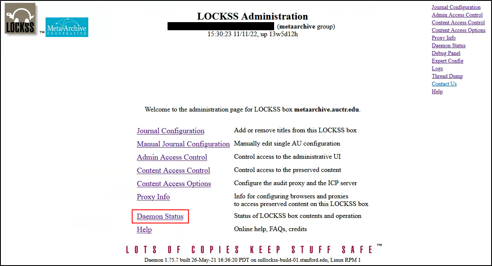
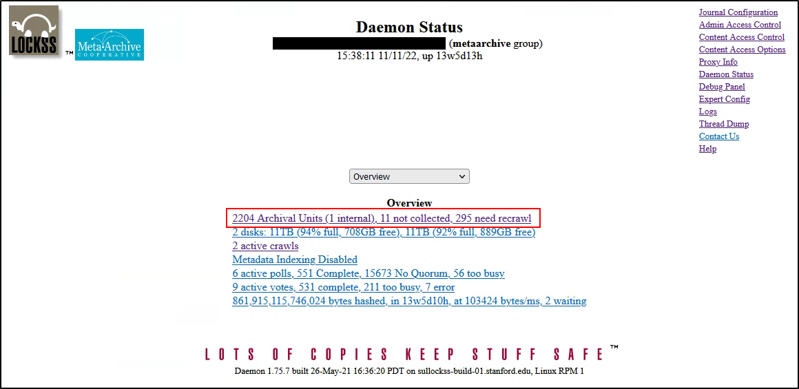
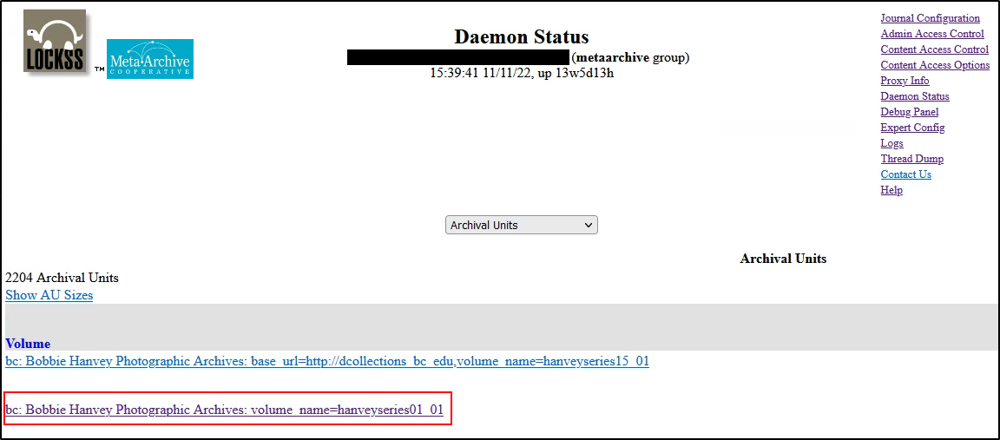
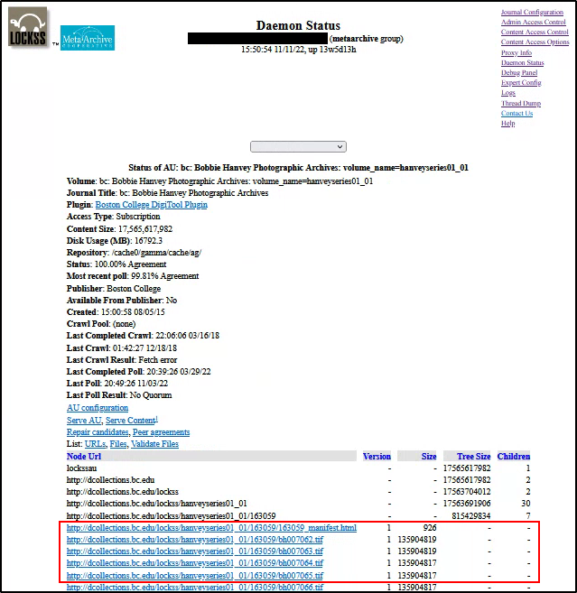

Content Management/Monitoring
=============================

*** 1 [Understanding the LOCKSS GUI](#ContentManagement/Monitoring-UnderstandingtheLOCKSSGUI)
* 2 [Manual fixity verification for AUs that are bagged (untested Conspectus feature?)](#ContentManagement/Monitoring-ManualfixityverificationforAUsthatarebagged(untestedConspectusfeature?))
	+ 2.1 [Accessing SHA-1 checksum values in LOCKSS](#ContentManagement/Monitoring-AccessingSHA-1checksumvaluesinLOCKSS)
* 3 [Serving AU / viewing files (quality control)](#ContentManagement/Monitoring-ServingAU/viewingfiles(qualitycontrol))
* 4 [Preservation Status Records in Conspectus](#ContentManagement/Monitoring-PreservationStatusRecordsinConspectus)
* 5 [Retiring AUs](#ContentManagement/Monitoring-RetiringAUs)
* 6 [Deactivating AUs](#ContentManagement/Monitoring-DeactivatingAUs)
* 7 [Deleting AUs](#ContentManagement/Monitoring-DeletingAUs)
* 8 [Versioning in LOCKSS](#ContentManagement/Monitoring-VersioninginLOCKSS)
* 9 [Interpreting LOCKSS errors, troubleshooting](#ContentManagement/Monitoring-InterpretingLOCKSSerrors,troubleshooting)
	+ 9.1 [File listing](#ContentManagement/Monitoring-Filelisting)
	+ 9.2 [Validating? (not really sure what this is, if it’s actually a fixity check or something else, need to ask LOCKSS)](#ContentManagement/Monitoring-Validating?(notreallysurewhatthisis,ifit’sactuallyafixitycheckorsomethingelse,needtoaskLOCKSS))
	+ 9.3 [Monitoring](#ContentManagement/Monitoring-Monitoring)

<!-- RH: Content at <https://wiki.metaarchive.org/metawiki/index.php/HowTos> was used for some of this and may be useful for the rest! -->**

Understanding the LOCKSS GUI
============================

<https://lockss.github.io/administrators/classic-lockss/> 

Manual fixity verification for AUs that are bagged (untested Conspectus feature?)
=================================================================================

The Conspectus enables those Members who have ingested Archival Units as BagIt packages to manually spot audit a copy of an individual Archival Unit. This can be helpful in those situations where Agreement results from a Last Poll may be showing as something less than 100%.

To initiate a spot audit of a BagIt-based Archival Unit:

1. Go to the Archival Units tab on the Collection Details page.
2. Click on the "Preserved" status link for an Archival Unit that you are interested in auditing.
3. From the list of copies, select a Cache from which you are interested in requesting a set of checksums. Note the Cache short name.
4. Now go to the Auditing Tools tab.
5. From the Cache dropdown select the Cache short name that you selected.
6. Now proceed to upload the manifest-md5.txt file for the Bag that corresponds to the Archival Unit that you are interested in auditing. Once uploaded, you can hit the Request Audit button.
7. The audit may take a few minutes to complete. Follow the instructions on the Request Successful page and follow up with your report at any time by clicking the link on that page or via the Reports link in the sidebar.

This answers the AirTable Question: "[How can I validate checksums of files that are uploaded to staging server and I set them to "test" status. Can I validate checksums of my content on in caches? Is it possible to get a report with checksums for my content?](https://airtable.com/shrC6B0dj791XsSAa/tblEkzKRxJh7Cea7g/viwciniHrChrmIqDs/recAqrTMCqVlhmOog)"

Accessing SHA-1 checksum values in LOCKSS
-----------------------------------------

Serving AU / viewing files (quality control)
============================================

There are two routes to viewing the content of an archival unit on a particular MetaArchive-LOCKSS cache:

1. Access the list of preserved files through the user interface of the LOCKSS daemon running on the cache
	1. Log into your cache's user interface
	2. Select **Daemon Status**

1. 1. Choose 'Archival Units' in the drop down list of available status tables

1. 1. Find the archival unit whose contents you would like to list and click on its link

1. 1. The page's bottom contains the list of files (broken up into a sequence of pages with 100 files each for large AUs). You can click on the file names to see the contents. Please note though that relative links do not work in this setting. The page also contains the link 'URL list' which points to a plain text list of file contained in the AU.

  

1. Activate the AUDIT Proxy on the preserving cache and browse contents in your web browser <!-- RH: see <https://wiki.metaarchive.org/metawiki/index.php/HowToAuditProxyAUContent> -->

Preservation Status Records in Conspectus
=========================================

Once your Collection Archival Units have been assigned for replication and ingests are underway you can monitor replication and audit agreement at any time by logging into the Conspectus and clicking on the Collection you are interested in monitoring.

On the Collection Details page, click on the Archival Units tab at the bottom of the page.

From the list of Archival Units, select whichever one(s) you are interested in monitoring and click the "Preserved" status link. The page that displays includes:

* **Caches:** Where your Archival unit is replicated
* **Size:** The size of your Archival Unit
* **Disk Usage:** File system and previous version totals in MB
* **Last Crawl:** When LOCKSS most recently returned to your web server to check for added/deleted/modified content
* **Crawl Result:** Result of most recent crawl
* **Last Poll:** When LOCKSS most recently audited a particular copy of your Archival Unit with the other copies listed
* **Agreement:** Result of most recent audit performed - as a percentage or message (e.g., "Calculating")

Retiring AUs
============

The LOCKSS daemon should stop harvesting from the web when web sites disappear. LOCKSS daemons determine whether a site is unavailable on the basis of title database settings. MetaArchive generates the title database's archival unit definitions from the data maintained by the Conspectus database. The Conspectus sets the "pub\_down" property to true whenever an archival units preservation status shows 'site down.'

The "down" attribute in the title database is part of an archival unit definition. If it is set to true LOCKSS daemons will not crawl the site any more, but will poll (even if it has never been crawled).

Deactivating AUs
================

Deactivating an AU is often the first step in removing it entirely from a LOCKSS system. In fact Deactivating an AU is just like Removing it, except that it keeps the AU's configuration around so that it is easy to Reactivate. The AU is completely gone from the daemon, but the files remain on the file system unless they are deleted manually.

In the MetaArchive network all participating daemons manage the same set of archival units and all archival units are dealt with in the same way. Thus institutions have to be in agreement when an archival unit is deactivated.

A system administrator at each institution needs to deactivate units through the local LOCKSS user interfaces. The steps are simple:

* Go to Journal Configuration and click Deactivate Titles
* Check the appropriate Content Provider and click Select AUs to produce a list of available Archival Units to deactivate
* Check the AU(s) that are to be deactivated and click Deactivate Selected AUs.

Deleting AUs
============

Removing an Archival Unit goes beyond inactivating it.

In the MetaArchive network all participating daemons manage the same set of archival units and all archival units are dealt with in the same way. All Participating institutions must agree to remove an archival unit.

A system administrator at each institution needs to remove units through the local LOCKSS user interfaces. The steps are simple:

* If the AU that you want to remove is inactive you need to reactivate it first
* Go to Journal Configuration | Remove Titles
* Select titles to produce a list of available Archival Units
* check mark those that are to be removed and confirm.

Please note that the LOCKSS system removes the archival unit from its regular operation and removes it from its internal configuration file but it does not remove any associated files from the file system. This intentionally leaves room for human error and leaves the door open for reviving units that were accidentally removed. Files are removed manually by system administrators only by issuing a 'rm -r' command for the listed directory after finding the directory that contains all files for a deleted archival unit in the Repository Table.

Versioning in LOCKSS
====================

Interpreting LOCKSS errors, troubleshooting
===========================================

<https://wiki.metaarchive.org/metawiki/index.php/HowToFindAusWithFetchErrors>

<https://wiki.metaarchive.org/metawiki/index.php/HowToFetchError>

File listing
------------

Validating? (not really sure what this is, if it’s actually a fixity check or something else, need to ask LOCKSS)
-----------------------------------------------------------------------------------------------------------------

Monitoring
----------

Conspectus, Monitor, NAGIOS

  

