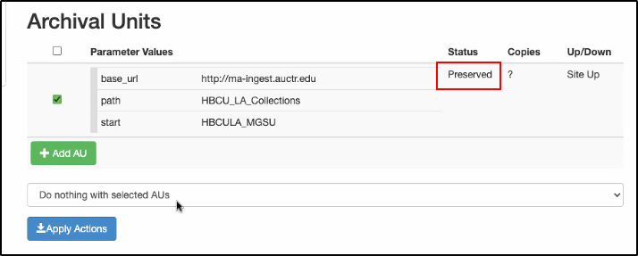

* 1 [Ingest Workflow Diagram](#IngestContent-trueIngestWorkflowDiagram)
* 2 [Create Archival Units (AUs)](#IngestContent-CreateArchivalUnits(AUs))
	+ 2.1 [Check for Junk System Files and Bad Filenames (optional but recommended)](#IngestContent-CheckforJunkSystemFilesandBadFilenames(optionalbutrecommended))
	+ 2.2 [Serialization (zip / tar) (optional)](#IngestContent-Serialization(zip/tar)(optional))
	+ 2.3 [Compressing (optional)](#IngestContent-Compressing(optional))
	+ 2.4 [Bagging (optional)](#IngestContent-Bagging(optional))
	+ 2.5 [HTML Manifest Page (required)](#IngestContent-HTMLManifestPage(required))
* 3 [Stage AUs](#IngestContent-StageAUs)
	+ 3.1 [Setting up the Staging Server](#IngestContent-SettinguptheStagingServer)
	+ 3.2 [Move AUs to the Staging Server](#IngestContent-MoveAUstotheStagingServer)
* 4 [Add AUs](#IngestContent-AddAUs)
	+ 4.1 [Create a New Plugin (optional)](#IngestContent-CreateaNewPlugin(optional))
		- 4.1.1 [Generic BagIt Plugins](#IngestContent-GenericBagItPlugins)
	+ 4.2 [Create a New Collection (optional)](#IngestContent-CreateaNewCollection(optional))
	+ 4.3 [Define the AUs in Conspectus](#IngestContent-DefinetheAUsinConspectus)
	+ 4.4 [Notify Central Staff](#IngestContent-NotifyCentralStaff)
* 5 [LOCKSS Crawling](#IngestContent-LOCKSSCrawling)
	+ 5.1 [Test the Plugin and AUs](#IngestContent-TestthePluginandAUs)
	+ 5.2 [Implement the Plugin and Move the AUs to the Production Network](#IngestContent-ImplementthePluginandMovetheAUstotheProductionNetwork)
	+ 5.3 [Issue Call for Ingests](#IngestContent-IssueCallforIngests)
	+ 5.4 [Add AUs](#IngestContent-AddAUs.1)
	+ 5.5 [Monitor for Replications](#IngestContent-MonitorforReplications)
* 6 [Clean Up Staged Content (Optional)](#IngestContent-CleanUpStagedContent(Optional))
	+ 6.1 [Move (or ask IT staff to move) Staged AUs Offline](#IngestContent-Move(oraskITstafftomove)StagedAUsOffline)

[Ingest Workflow Diagram](https://drive.google.com/file/d/1SRV6Lm0FUsFfNAz5er_Gkwaiyj57XlZV/view)
==============================================================================================================================================================================================================================================================================================================================================================================================================================================================================================================================================================================================================================================================================================================================================================================================================================================================================================================================================================================================================================================================================================================================================================================================================================================================================================================================================================================================================================================================================================================================================================================================================================================================================================================================================================================================================================================================================================================================================================================================================================================================================

Create Archival Units (AUs)
===========================

Divide a large collection, if necessary, into groupings called [Archival Units](/public-documentation/MetaArchive-Cooperative/Knowledge-Base/Archival-Units-(AUs)) (typically between 1GB-300GB).  Archival Unit groupings may correspond to publication years, to file formats, to topic strings, etc. 

If you haven't already, [prep your content for ingest](/public-documentation/MetaArchive-Cooperative/Technical-Workflows/Prepare-Content-for-Ingest):

1. Make sure to not only include content, but also metadata (preferably in an open licensed machine-readable format like XML or CSV).
2. Make sure data and metadata are organized such that you can use or build tools to restore the collection later.
3. Optionally, include documentation (text file or PDF) of the intended restoration procedures to be used with the content.

Once your content is prepped, follow the optional and required steps described below to create AUs:

1. Optionally, check for junk system files using the [find-bad-files.py](/public-documentation/MetaArchive-Cooperative/Technical-Workflows/Ingest-Content/Using-the-BagIt-find-bad-files.py-Script) script.
2. Optionally, use a file archiver to [zip/tar](/public-documentation/MetaArchive-Cooperative/Knowledge-Base/Serialization) the file.
3. Optionally, use lossless compression to reduce the storage footprint of the AU.
4. Optionally, bag content – MetaArchive supports [BagIt](/public-documentation/MetaArchive-Cooperative/Knowledge-Base/Bags-and-Bagging)-based ingests.
5. Make sure to create an HTML Manifest Page, which LOCKSS uses to record permission for crawling/harvesting.

For ingests over 1TB (terabyte), please contact the Community Facilitator a few months in advance to give time to plan for network load balancing.

For a visualization of the process, see this OSSArcFlow diagram of MetaArchive's Ingest Workflow: <https://drive.google.com/file/d/1SRV6Lm0FUsFfNAz5er_Gkwaiyj57XlZV/view>

Please don't hesitate to contact [support@metaarchive.org](mailto:support@metaarchive.org) at any time with your questions.

Check for Junk System Files and Bad Filenames (optional but recommended)
------------------------------------------------------------------------

Operating systems like Windows and and MacOS often include invisible system files in their folders (DS\_Store, thumbnails, etc.). If these files are included in AUs, they can artifically increase the space (and cost) of AUs unnecessarily.

Additionally, web-based files with non-alphanumeric characters need to limit those characters to just dots, hyphens, and underscores: . - \_

Follow the steps at [Using the BagIt find-bad-files.py Script](/public-documentation/MetaArchive-Cooperative/Technical-Workflows/Ingest-Content/Using-the-BagIt-find-bad-files.py-Script) to ensure that any junk files are removed and that filenames are correctly formatted.

This step is optional since the extra files won't cause problems for LOCKSS or the AUs, so some institutions may choose to skip this step to save time/effort.

Serialization (zip / tar) (optional)
------------------------------------

Zipping or tarring a group of files using a [file archiver](/public-documentation/MetaArchive-Cooperative/Knowledge-Base/File-archivers-and-zipping) makes recovery/movement a little easier technically, if there aren't thousands of files. But it's not the best thing for every scenario:

* If you're using temporary [staging](/public-documentation/MetaArchive-Cooperative/Knowledge-Base/Staging-Server), it might make sense to zip/tar your archival units.
* However, if you're using permanent staging (e.g. a publicly crawlable site of journals), it doesn't make as much sense to zip/tar.
* If you are using AWS for staging, AUs need to be [serialized](/public-documentation/MetaArchive-Cooperative/Knowledge-Base/Serialization). (Source: AirTable Question "[Should bags be zipped?](https://airtable.com/shrC6B0dj791XsSAa/tblEkzKRxJh7Cea7g/viwciniHrChrmIqDs/recty6nC3zoifktUF)")

This step is optional since LOCKSS can handle both regular (non-serialized) and zipped/tarred (serialized) files, so institutions may choose to skip this step depending on their workflows/needs.

Compressing (optional)
----------------------

Be mindful of the impact of [lossy](https://en.wikipedia.org/wiki/Lossy_compression) vs. [lossless](https://en.wikipedia.org/wiki/Lossless_compression) compression when zipping/tarring preservation files.

* Bags can be compressed, but you might not want to. Many preservationists avoid compression, particularly lossy compression. It introduces risk by making files more fragile and susceptible to catastrophic damage in the event of a bit flip. Lossy compression results in permanent loss of the original data, i.e. it's non-reversible.
* However, use and implementation of lossless compression (which is reversible) can be a valid decision if it suits institutional needs and constraints, just be warned and have good documentation of your workflow choices. (Source: AirTable Question "[If bags are zipped or tarred, can they be compressed?](https://airtable.com/shrC6B0dj791XsSAa/tblEkzKRxJh7Cea7g/viwciniHrChrmIqDs/recSuaIXBF6JGwMDd)")

This step is optional since LOCKSS can handle both compressed and uncompressed zip/tar files, so institutions may choose to skip this step depending on their workflows/needs.

Bagging (optional)
------------------

**[Bagging](/public-documentation/MetaArchive-Cooperative/Knowledge-Base/Bags-and-Bagging)** refers to using the [BagIt Specification](https://www.ietf.org/rfc/rfc8493.txt) from the Library of Congress to package up content into a standardized format that includes generating checksums for files and recording contact information for the included content (see: [BagIt at Wikipedia](https://en.wikipedia.org/wiki/BagIt)).  These standardized files, called **bags**, can be used to create AUs.

There are many tools available to create bags, including several that MetaArchive members have used:

* [Bagger](/public-documentation/MetaArchive-Cooperative/Knowledge-Base/Bagger)
* [BagIt Python](/public-documentation/MetaArchive-Cooperative/Knowledge-Base/BagIt-Python)
* [DART](/public-documentation/MetaArchive-Cooperative/Knowledge-Base/DART)
* [Exactly](/public-documentation/MetaArchive-Cooperative/Knowledge-Base/Exactly)
* [Java BagIt Library (BIL)](https://github.com/LibraryOfCongress/bagit-java)

The MetaArchive has prepared a series of easy-to-follow instructions for making use of Bagger and bagit.py. Those instructions can be found beginning on page 7 of the .

Bagging creates [checksums](/public-documentation/MetaArchive-Cooperative/Knowledge-Base/Checksum) and [manifests](/public-documentation/MetaArchive-Cooperative/Knowledge-Base/Manifest), but these are **not** required for the LOCKSS software to work – LOCKSS manages fixity using the [polling and voting](/public-documentation/MetaArchive-Cooperative/Knowledge-Base/Polling-and-Voting) functionality of the software. This provides some context for the AirTable Question "[Are any member orgs ingesting non-bagged content?](https://airtable.com/shrC6B0dj791XsSAa/tblEkzKRxJh7Cea7g/viwciniHrChrmIqDs/recY3kck5pDsQlsUq)"

HTML Manifest Page (required)
-----------------------------

Before ingesting the AU, you need to create an [HTML Manifest Page](/public-documentation/MetaArchive-Cooperative/Knowledge-Base/HTML-Manifest-Page) that describes the content, contact information, and permissions for LOCKSS to crawl/harvest the data.

Stage AUs
=========

The Content Owner prepares (or stages) content for preservation by:

* Making content accessible in a firewalled web hosted directory
* Organizing content so that document files and metadata can be harvested together by LOCKSS caches
* Preparing a collection description in the MetaArchive's Conspectus tool
* Giving the collection a title and archive designation
* Entering the source URL (base\_url) for the web hosted directory
* Providing some descriptive metadata for the collection

Setting up the Staging Server
-----------------------------

In order for any of the above to take place it is necessary for a MetaArchive member or subsidiary to create and provide access to a Base URL (base\_url) from a firewall-protected webserver. This is a dedicated web address with the capacity to store digital content and have access to the internet.

This webserver is the Base URL which is where MetaArchive’s crawler algorithm is directed to harvest digital content. A [web crawler](https://en.wikipedia.org/wiki/Web_crawler) is a program which automatically visits a website and creates copies of the digital content found on that address. Hence the name, it then crawls through web content piece by piece and gathers copies.

With the current Bagger-supported crawl rules for MetaArchive this process is far simpler and more accessible than ever.

The Base URL is a critical piece of infrastructure for harvesting and preservation. It is placed in the Conspectus Collection page of members as well as in the Manifest and plugin page documents. If this Base URL is not associated with a correctly configured webserver or if the Base URL is entered incorrectly the MetaArchive system cannot find and harvest member collection data.

The MetaArchive Conspectus page allows for a test ingest procedure to ensure that if any problems with the server or Collection/Content Provider page are present they can be identified and remedied before the final Preservation Ingest.

Ideally, a member is able to open up the staging server to the world. Sometimes, they are not comfortable doing this. In these cases, they will need to configure their webserver to allow one of the Apache-protected IP lists. This is documented here: <https://docs.google.com/document/d/1YslKRH6yNLQJCUxDEHByROdzBwvMA2QgkmcHMG34OkQ/edit?usp=sharing>.

See also: OSSArcFlow workflow diagram for MetaArchive firewall changes: <https://drive.google.com/file/d/1vrvRRTHcCGu5luWXKJ6D3lb79CDChCT8/view>

Move AUs to the Staging Server
------------------------------

Add AUs
=======

Create a New Plugin (optional)
------------------------------

Once a Member has staged one or more Bags for an ingest into MetaArchive, they will need to install a generic MetaArchive BagIt plugin in their content provider directory.   

### Generic BagIt Plugins

Members can copy one of the existing bagitplugins in <https://github.com/MetaArchive/lockss-plugin-xml> to their content provider directory and commit the plugin via SVN. There are two plugins each with different archival unit parameters depending upon what is needed.

* **bagitplugin1.xml has only one parameter (start)**
	+ Perfect for situations where a bag just lives at the root directory - the "start" parameter encompasses the bag folder where the /data/ directory lives
* **bagitplugin2.xml has two parameters (start, path)**
	+ Perfect for situations where a bag lives in a sub-directory - the "path" parameter should encompass the sub-directory(ies) to the main bag folder; the "start" parameter encompasses the bag folder where the /data/ directory resides

These can be further adapted if needed, but should be sufficient given the simple and all-encompassing /data/ directory structure that BagIt makes use of.

Create a New Collection (optional)
----------------------------------

1. **Member**or **Central Staff** uploads plugin XML or generates a plugin in Conspectus.
2. **Member**or **Central Staff**configures a collection that uses the plugin (if performed by central staff, be sure to consult with the member on collection properties, especially the name –avoid changing collection names.)
	1. Do not include a trailing slash in the Base URL
	2. Use the same plugin prefix as listed on the [Content Provider list](https://conspectus.metaarchive.org/content_providers)

Define the AUs in Conspectus
----------------------------

**Member** defines the AUs in the collection.

After Bags have been transferred to the staging server, Archival Units (AUs) are created. Archival Units serve as pointers to the Bags on the staging server to allow MetaArchive staff and MetaArchive Members to find the Bags and ingest them into the network of LOCKSS servers.

Individual archival units (AUs) need to be made within each collection page. These archival units must correspond to the Bags made from member data collections. The AU parameters must be configured correctly so as to be the same as the Bag name and data harvesting folder name.

The [MetaArchive Conspectus](https://conspectus.metaarchive.org) is used to create Archival Units.  MetaArchive Members have login credentials to access the Conspectus. The basic steps for creating AUs are shown here:

1. Login to the Conspectus at <https://conspectus.metaarchive.org>
2. Navigate to collection where new archival units / bags will be added:
	1. Select Archival Units tab
	2. Select Manage Archival Units
	3. Select Add AU
	4. For the “path” value enter Ingest
	5. For the “start” value enter the bag identifier
	6. Select Apply Actions
	7. Select the checkbox next to new AU
	8. Select Change status to Test from dropdown menu
	9. Select Apply Actions
1. Add new archival units / bags to collection

Notify Central Staff
--------------------

When new AUs have been added to a collection in the Conspectus, a request is sent to [support@metaarchive.org](mailto:support@metaarchive.org) via the [MetaArchive Ingest Form](https://airtable.com/shrnpOZrBS2FN1qyr) with the following information:

* Collection name
* List of new AUs and individual bag data size
* Total data size of new ingest

LOCKSS Crawling
===============

This request initiates a test crawl on the specified content AUs within a Collection Page. This test will identify any errors of problems present in how this unit is configured. If errors are present, this process will have to be repeated once the issues are identified and corrected.

Following a successful test ingest, a preservation ingest will be initiated. This is the real time preservation offered by MetaArchive and will eventually comprise a set of 7 copies of collection data held in distributed locations around the United States.

The copies maintained in this set of servers will be constantly checked against one another for errors or data corruption and if problems of this sort are identified the damaged portion will be corrected.  This process provides a secure method of preserving valuable cultural content. 

Test the Plugin and AUs
-----------------------

1. **Central Staff** uploads the plugin XML to the admin server (`/home/metaarchive/admin/lockss-plugin-xml/test`) and run the update script (`/home/metaarchive/admin/lockss_test/plugins/update`) to sign and compile the XML into a JAR file. The plugin XML compiled must exactly match the plugin XML in Conspectus.  

	1. Run `ls -ls | head -10` in the plugin directory to verify that the first file is the new plugin JAR and that the file name matches the plugin name in the XML.
	2. Run the verify script to validate the plugin. (This may take a while as it checks every plugin.)
2. **Central Staff** updates AU status to Test. The test network title database is automatically generated every fifteen minutes starting on the hour.
3. **Central Staff** logs into a test cache.
4. **Central Staff** forces a recrawl of the MetaArchive plugin repository AU on the test cache to be sure LOCKSS will see the new plugin.
5. **Central Staff** forces an update on the title database on the test cache by going to the Debug Panel and clicking "Reload Config".
6. **Central Staff** adds the test AU(s) to the test cache and monitor crawling for issues.

Implement the Plugin and Move the AUs to the Production Network
---------------------------------------------------------------

1. **If the plugin does not yet exist, do steps 2 & 3, if the plugin already exists, skip to step 4.**
2. **Central Staff** copies the plugin XML from `/home/metaarchive/admin/lockss-plugin-xml/test` to `/home/metaarchive/admin/lockss-plugin-xml/production` (using the appropriate subdirectories).
3. **Central Staff** runs the update script (`/home/metaarchive/admin/lockss/plugins/update`) to sign and compile the XML into a JAR file. The plugin XML compiled must exactly match the plugin XML in Conspectus.
	1. Run ls -ls | head -10 (or ls -ltr) in the plugin directory to verify that the first file is the new plugin JAR and that the file name matches the plugin name in the XML.
	2. Run the verify script to validate the plugin. (This may take a while as it checks every plugin.)
4. **Central Staff** updates the AU status to Preserved.  In Conspectus on the page for the AU, from the drop-down menu at the bottom select *Change selected AUs status to Preserved*(a). Then click on *Apply Actions* to update the status to Preserved (b)  

	1. 
	2. 
5. **Central Staff** manually updates the production title database by running the update script (`/home/metaarchive/admin/lockss/config/update`).

Issue Call for Ingests
----------------------

1. **Central Staff** assigns replication targets based on:
	1. Cache buddy: Assign non-cache hosting members' content to their "cache buddy" so that members can perform QC
	2. Geographic distribution: AUs should be assigned to no more than two caches in the same region as the content provider and all five caches holding the replicated AUs should be located in at least three different geographic regions.
	3. Available cache space
	4. SSH access: Always try to include a target cache to which we have full SSH access (for troubleshooting)
2. **Central Staff** sends a message to assigned caches on [ma\_dev@metaarchive.org](mailto:ma_dev@metaarchive.org) to add the new AUs

Add AUs
-------

All steps below are for **Cache Admins**

1. Access your LOCKSS cache. To access the Web-based user interface on your LOCKSS box, access the following URL from any browser: http://<YOUR\_NODE>:8081/
2. Click "Journal Configuration".
3. Click "Add Titles".
4. Select The institution (or group) indicated by the central staff to add the specific collection title(s).
5. Click "Select AUs".
6. Select all Available Disks
7. Select only the archival units (AUs) you wish to add (LOCKSS will assign each AU to an Available Disk)
8. Click "Add Selected AUs"
9. You should see the message "# AU added"
10. You can now close the browser window.

Monitor for Replications
------------------------

1. **Cache Admins** reply-all or notify [techsupport@metaarchive.org](mailto:techsupport@metaarchive.org) that they have added the AUs
2. After two weeks, **Central Staff** monitors the status of ingests and adds the AUs to caches that have not already done so
3. **Central Staff** monitors for [AU health (content availability, polling)](/public-documentation/MetaArchive-Cooperative/Technical-Workflows/MetaArchive-Quality-Assurance-Strategy)
4. **Central Staff** notifies the member that AUs have been ingested

Clean Up Staged Content (Optional)
==================================

Move (or ask IT staff to move) Staged AUs Offline
-------------------------------------------------

1. **Member** notifies Central Staff that they are removing AUs from staging
2. **Central Staff** set AU availability to Site Down
