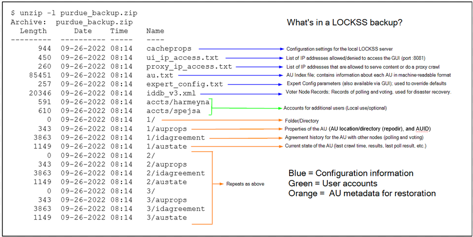
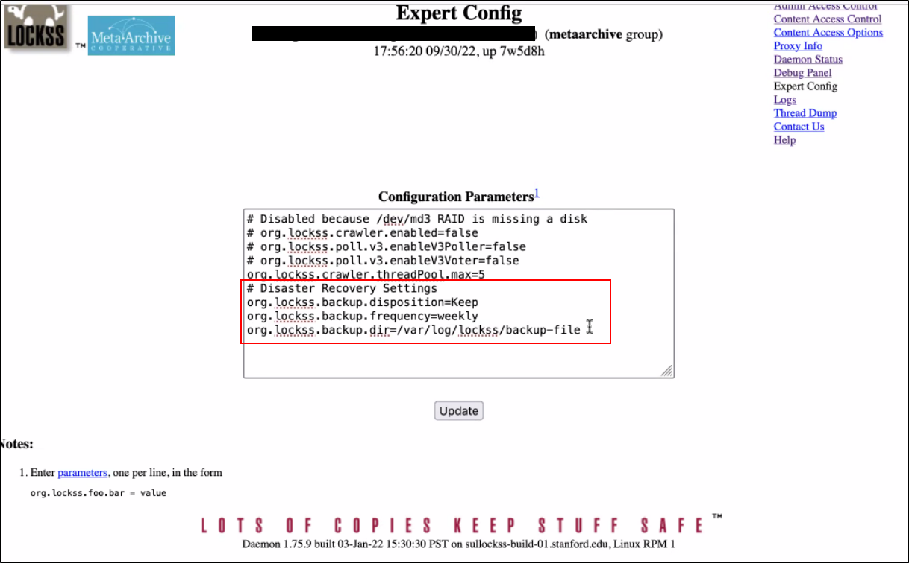
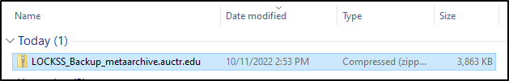
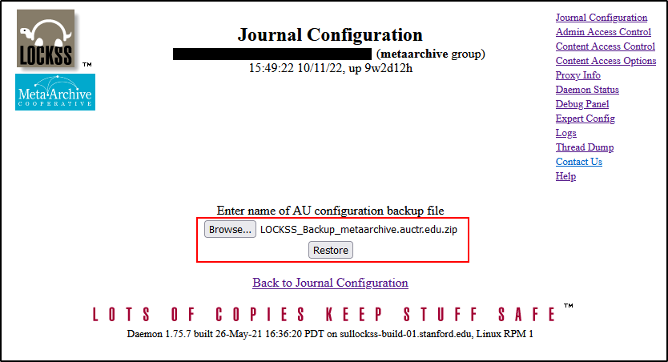

Post-Failure Restoration
========================


* 1 [Backup Overview](#PostFailureRestoration-trueBackupOverview)
	+ 1.1 [Option 1 (MA Managed): Backup Cache Config to the /var/log/lockss/backup-file directory, and copy to the Admin server](#PostFailureRestoration-Option1(MAManaged):BackupCacheConfigtothe/var/log/lockss/backup-filedirectory,andcopytotheAdminserver)
	+ 1.2 [Option 2 (Manual): Backup Cache Config to a file on your workstation](#PostFailureRestoration-Option2(Manual):BackupCacheConfigtoafileonyourworkstation)
* 2 [Restore Overview](#PostFailureRestoration-RestoreOverview)
	+ 2.1 [Restore LOCKSS Instance from the LOCKSS backup file on your workstation](#PostFailureRestoration-RestoreLOCKSSInstancefromtheLOCKSSbackupfileonyourworkstation)


Backup Overview
===========================================================================================================================================================================================================================================================================================================================================================================================================================================================================================================================================================================================================================================================================================================================================================

Disaster recovery for LOCKSS involves creating a backup file.  In case of a hardware failure, the backup file can be used to rebuild the LOCKSS cache on new hardware.

A **LOCKSS backup file** is a backup of the local LOCKSS instance (sometimes called a *cache*) configuration to a .zip file (typically **config\_backup.zip**). 

The backup file *is not* a backup copy of the archival units themselves or their data, but instead a disaster recovery file that contains:

1. Configuration information for the LOCKSS instance and its AUs
2. Any additional user accounts that have been created for this particular LOCKSS instance
3. Internal configuration information for each AU

Click the image below to see an explanation of what's in a LOCKSS backup.  Note that this is an example, and not all backups will look just like this.



**NOTE**: In the backup file, the number of AUs listed will always be *one less* than the total AUs visible on the Daemon Status.  There's one less for each plugin registry in the LOCKSS network – for MetaArchive, that's only one because we only have one plugin registry.

  


Option 1 (MA Managed): Backup Cache Config to the /var/log/lockss/backup-file directory, and copy to the Admin server
---------------------------------------------------------------------------------------------------------------------

By default, all MetaArchive caches are now set up to create a Backup to the local LOCKSS box using the [LOCKSS Administration GUI](/public-documentation/MetaArchive Cooperative/Knowledge Base/LOCKSS) under **Expert Config:**


> 
> ```
> #Disaster Recovery Settings  
> org.lockss.backup.disposition=Keep  
> org.lockss.backup.frequency=weekly  
> org.lockss.backup.dir=/var/log/lockss/backup-file
> ```
> 



**NOTE:** Backing up to the same machine will not help in the case of a disaster or hard drive failure.  Backups are automatically copied to the central MA Admin server in case of disaster (Server Admins, see: Config file backups).

Option 2 (Manual): Backup Cache Config to a file on your workstation
--------------------------------------------------------------------

To create a Backup using the [LOCKSS Administration GUI](/public-documentation/MetaArchive Cooperative/Knowledge Base/LOCKSS), go to **Journal Configuration** > **Backup** and click on **Retrieve** to generate and automatically download a backup cache config .zip file.


The file will appear in your default download location.



Restore Overview
================

Restore LOCKSS Instance from the LOCKSS backup file on your workstation
-----------------------------------------------------------------------

To Restore from a local LOCKSS backup file using the [LOCKSS Administration GUI](/public-documentation/MetaArchive Cooperative/Knowledge Base/LOCKSS), go to **Journal Configuration** > **Restore** and click on **Browse** to select your backup file, then click on **Restore**.



**NOTE:** Ideally, content will still be available on staging servers for the system to re-crawl to again repopulate the (restored) cache with AUs.  However, if content is not available from the staging servers, then the content will need to be retrieved using a **proxy crawl**.

  


