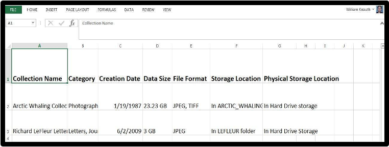
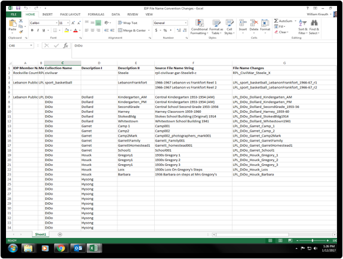
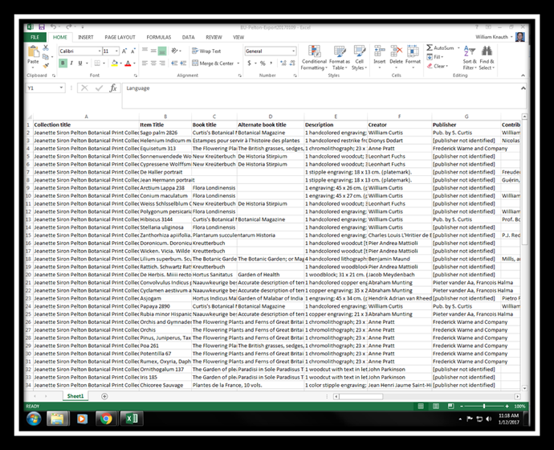

Prepare Content for Ingest
==========================

*** 1 [Local Management of Digital Content](#PrepareContentforIngest-LocalManagementofDigitalContent)
	+ 1.1 [Create Inventory](#PrepareContentforIngest-CreateInventory)
		- 1.1.1 [The Importance of the Collections Inventory](#PrepareContentforIngest-TheImportanceoftheCollectionsInventory)
		- 1.1.2 [Categories of Content](#PrepareContentforIngest-CategoriesofContent)
		- 1.1.3 [Date of Creation and Extent](#PrepareContentforIngest-DateofCreationandExtent)
		- 1.1.4 [Available Metadata](#PrepareContentforIngest-AvailableMetadata)
		- 1.1.5 [Formats](#PrepareContentforIngest-Formats)
		- 1.1.6 [Storage Locations](#PrepareContentforIngest-StorageLocations)
	+ 1.2 [Select Content to Be Preserved](#PrepareContentforIngest-SelectContenttoBePreserved)
		- 1.2.1 [Risk Factors](#PrepareContentforIngest-RiskFactors)
		- 1.2.2 [Selection Criteria](#PrepareContentforIngest-SelectionCriteria)
		- 1.2.3 [Reviewing Content](#PrepareContentforIngest-ReviewingContent)
	+ 1.3 [Organize Data Files](#PrepareContentforIngest-OrganizeDataFiles)
		- 1.3.1 [Importance of Organization and Management](#PrepareContentforIngest-ImportanceofOrganizationandManagement)
		- 1.3.2 [File Naming Guidelines](#PrepareContentforIngest-FileNamingGuidelines)
		- 1.3.3 [File Naming Examples](#PrepareContentforIngest-FileNamingExamples)
		- 1.3.4 [MetaArchive Member Acronyms](#PrepareContentforIngest-MetaArchiveMemberAcronyms)
		- 1.3.5 [Recording File Name Changes](#PrepareContentforIngest-RecordingFileNameChanges)
	+ 1.4 [Create Metadata](#PrepareContentforIngest-CreateMetadata)
		- 1.4.1 [Metadata Significance](#PrepareContentforIngest-MetadataSignificance)
		- 1.4.2 [Inclusion of Collection & Item Level Metadata](#PrepareContentforIngest-InclusionofCollection&ItemLevelMetadata)
		- 1.4.3 [Minimum Metadata Elements](#PrepareContentforIngest-MinimumMetadataElements)
			* 1.4.3.1 [Example of Collection Level Metadata](#PrepareContentforIngest-ExampleofCollectionLevelMetadata)
			* 1.4.3.2 [Example of Item Level Metadata exported from InDiPres member collection metadata in CONTENTdm](#PrepareContentforIngest-ExampleofItemLevelMetadataexportedfromInDiPresmembercollectionmetadatainCONTENTdm)
	+ 1.5 [Personally Identifiable Information (PII)](#PrepareContentforIngest-PersonallyIdentifiableInformation(PII))
		- 1.5.1 [PII Examples](#PrepareContentforIngest-PIIExamples)
	+ 1.6 [Copyright](#PrepareContentforIngest-Copyright)
	+ 1.7 [Preservation policy guidance](#PrepareContentforIngest-Preservationpolicyguidance)**

**Local Management of Digital Content**
=======================================

This section will provide information and suggestions on collection management and organization for MetaArchive member institutions. Establishing physical and intellectual control of a set of digital collections is an important element of a digital preservation program. 

**Create Inventory**
--------------------

### **The Importance of the Collections Inventory**

The inventory serves as an overall guide to the digital collections held by your organization and should be updated with new information as additional content is created, decisions are made, and/or actions taken. It is suggested that the inventory document be the responsibility of one individual in order to keep the data entry consistent. Develop an inventory instrument that makes sense for your institution and its needs. To create the inventory use software with which you are already familiar and which is easy to use. A spreadsheet program like Microsoft Excel or OpenOffice Calc are two useful basic and easily accessible software tools for collection inventory.  

It would be ideal to work on creating an effective and accurate inventory of all the digital content currently held by your institution. This should include in-process and completed digital collections. The goal of this effort is to ascertain and document what digital assets are present, their category, date of creation, extent, format, available metadata, and storage location. This can be as simple as a list of collection names and their data size and whatever other metadata information is available. With this established it is much simpler to plan and prioritize when enacting a program of digital preservation.

*Basic Example of an Excel Digital Collection Inventory*

  
  

### **Categories of Content**

An effective strategy to organize content is to differentiate collections according to relevant categories. There are many different possible categories, and each MetaArchive institution is best situated to know these options for their own collections. One example of a category would be to assign each digital collection a type category based on the nature of the collection content. Examples of these content categories such as “Photographs,” “Documents,” “Public Records,” “Oral Histories,” and “Audio” or “Video” are appropriate designations. 

MetaArchive members may also find it useful to note the origin of the digital collections and whether the content has an “analog” counterpart or if it is “born digital.” Analog to digital content means that a given collection is a digital facsimile of a real physical set of materials. “Born Digital,” on the other hand, indicates that a collection was generated from its inception as digital data and does not have a corresponding physical version.  

### **Date of Creation and Extent**

An important piece of technical information for digital files is their age and total size. Include in the inventory the date each collection was digitized as well as its approximate data size. It is important at several key stages in the process of digital preservation to know the size of the data batches being transferred and preserved.  A collection’s size affects processing time and the collection’s interaction with MetaArchive's preservation network. Also knowing how long digital data has existed is critical to judging its potential for degradation. The risk of degradation is an important factor in determining preservation priorities.  

### **Available Metadata**

Note the availability of both item- and collection-level metadata. Item-level metadata will be packaged with the related data files for ingest into the preservation network; and thus, will be retrievable along with the content should file restoration be required. Collection-level metadata is used to describe the collection as a whole at different points of processing.

### **Formats**

Record the file formats of your digital collections. The MetaArchive Cooperative Preservation Network is platform agnostic and will accept all types of data. However, it is important to know the file formats of your data in case it is necessary to migrate from an obsolete platform into a new format. Using stable file formats in the creation of digital content helps ensure the longevity of the data. Examples of stable formats are: TIFF, JPEG, PDF and WAV.

### **Storage Locations**

Add the location where digital collection data is stored to the inventory. This could be online, offline, or through the use of external media such as tapes, DVDs, or CDs. If you are using network storage specify the exact file path where the collection is stored. If you have multiple copies note where each file resides.

**Select Content to Be Preserved**
----------------------------------

This portion offers assistance with decision-making. It will set out best practices and guidelines to consider in determining member preservation priorities when selecting content for preservation. Individual MetaArchive members are considered to be the experts on their digital materials. It is up to each member to decide which of their digital collections require long term preservation, and the order in which they are submitted for ingest into the MetaArchive Preservation Network. 

### **Risk Factors**

Risk factors are threats to the integrity and accessibility of digital material. Digital content is far more fragile than its analog counterpart and can be permanently lost or damaged for a variety of reasons.  

When deciding on what digital content to preserve, there are three major risk factors to consider.  Weighing these factors within the framework of your institution’s total holdings allows you to determine the degree of risk that can be assigned to each and aides in prioritizing collections for preservation.

* **Change and Loss**: How vulnerable is the data and byte integrity of the digital collection? Is it possible or likely that the data could become corrupted? The individual bytes of data can corrode and lose their integrity over time if not checked and transferred at set intervals. In this way collection data on a hard drive can become unusable even if the device is stored safely and undamaged by any other outside force. Data can also be deleted or altered intentionally or by accident.
* **Obsolescence**: A collection’s age, formatting, type of technology device or access program can be a source of problems for digital content. Technology evolves quickly, rendering software and playback devices obsolete. File formats and types also change over time and necessary access equipment or software may become difficult or impossible to locate. Digital content may require reformatting or emulation in a new application in order to retain access to the data.
* **Disaster Damage**: Are there any serious threats to the existence of this digital collection? Disaster damage can come in the form of fire, floods, electrical damage from storms or other threats from natural disasters.

### **Selection Criteria**

In addition to creating an inventory, it is important to develop selection criteria to help you prioritize data for long term preservation. Developing selection criteria for digital content is similar to creating a collection development policy. Digital collections, selection criteria, and the digital preservation plan should be represented in an institution’s collection development policy. Here are some things to consider:  

* **Central Institutional Mission**: What is the primary mission of the institution in question? Which collections best support and reinforce that mission and its goals?
* **Collection Development Policy**: Would the preservation of a given digital collection support major elements of an institution’s Collection Development Policy?
* **Required to Keep**: Does this digital collection or its physical analogues have donation agreements, grant agreements, or other legal requirements requiring the institution to keep and preserve the content?
* **Uniqueness**: Is the collection unique to its specific repository, or do other institutions hold duplicate digital or analogue copies? Digital collections which are present in other institutions may have a lower risk of loss and this affects their priority for preservation.
* **Significance**: How important might a given digital collection be to future users of the content? How does it relate to persons, events, or other features of importance either for the local region, institutional audience, country of origin, or for the world as a whole?
* **Frequency of Use**: How much is the collection used by scholars, students, or members of the local community? Digital collections that are in higher demand and significance to the institution's patrons should be given higher preservation priority.
* **Age of Content:** The more time that has passed since the original digitization the more at risk the collection data can be for degradation. Depending on formatting and other circumstances this degradation can occur within 5 years. Additionally if the physical collection the digital scans were made from is very old, fragile, or at risk for damage this also should give the preservation of digital copies of this material priority for ingest into MetaArchive.
* **Extent of Content Data**: How many gigabytes of digital content is present in each collection under consideration for preservation? Ingest batches preserved through MetaArchive work best when in the area of 30-100 gigabytes. Larger collections can be accommodated by MetaArchive, but these require the data to be divided into ingest units of the suggested size. **<!-- CL: will they still be divided into ingest units of the suggested size? RH: Note that this size range differs from AU recommended sizes listed elsewhere in this document! -->**
* **Value of Resource**: It is useful to consider the monetary value of digital collections and their physical parent collection. Consider also the investment in institutional time and resources in digitizing this content when making preservation priorities.
* **Who Owns Rights:** This is frequently a topic of concern with digital preservation and digitization. It is suggested that collections to which an institution indisputably holds the copyright be given priority for preservation both for intellectual property reasons and because it may represent a truly unique and valuable cultural heritage resource. The MetaArchive is a dark archive with zero content access outside of the content owner and the MetaArchive staff.
* **Digital Quality:** Consider the quality of the original digitization that created the collections in question. Is it high quality or low quality? Does it accurately capture the original material and is it a useful substitute for viewing the physical items? If digitization was done poorly and resulted in blurry, inaccurate, or low resolution digital copies, the poor quality should weigh against this material being digitally preserved.

### **Reviewing Content**

An important point in the selection effort is to document the priority decisions and selection criteria made by MetaArchive member institutions. It is important to do this to avoid a situation where the effort of this process becomes unavailable and has to be done again. An effective method of doing this, and one suggested generally for organizing digital collections, is to create a spreadsheet with each digital collection listed. Populate this list then with all the relevant information about file name, data size, storage location, metadata, and any other descriptive or technical information that would be useful depending on the member institution’s unique circumstances. Decision points related to the content selection include the following:   

* **Fits Criteria**: How well does a collection score on the several criteria of value and importance used for assessing and prioritizing digital collections for preservation? How to determine and apply this assessment is largely up to individual MetaArchive members. An effective method might be to assign a numeric value to the desired criteria listed earlier in this section, rank a potential preservation collection by these metrics, and then use the combined score from this to determine preservation order.
* **Feasibility for Preservation:** What are the major obstacles to a specific collection being digitally preserved through MetaArchive?  Once the obstacles are identified, determine if they are surmountable or insurmountable.
* **Consistency of Content:** Take note of issues like file naming conventions used, level of description, quality of digitization, file formatting. If there is a great deal of variation on these points within a collection, it could make this material less of a priority for preservation.

**Organize Data Files**
-----------------------

### **Importance of Organization and Management**

A key piece of the MetaArchive Cooperative is to offer its members the guidance and best practices that empower staff to take physical and intellectual control of local digital collections. When developing and implementing policies for the creation, organization, and management of digital content, it is important that decisions  are documented and followed for consistency. Writing a local digital preservation policy and plan to address your institution’s collections and establishing it as part of your overall collection development or management document will ensure that digital preservation becomes an integral part of your institution’s mission. On the collection level, categorizing digital content, its format, extent, organization, available metadata, and storage locations are vital components of appropriate stewardship of digital assets for long-term preservation. Creating an inventory instrument to record detailed information about your institution’s digital collections will assist you in tracking the characteristics and life cycle of its digital assets.

### **File Naming Guidelines**

It is important to establish appropriate and accurate file naming conventions for content being digitized. Decide upon a short, simple set of naming practices and apply them consistently. Create file name guidelines that fit the needs of your individual institution and collections. Abbreviate when possible, but the more descriptive the file name the easier it will be to recognize the content being represented. Be consistent in structuring the elements of the file names such as the presentation of dates or proper nouns. It is advisable to add this to your institution’s established preservation workflow formally, and apply this file naming to digital content being accessioned into collection holdings. 

*File Naming Best Practices*

1. Do not use spaces, because they are not recognized by some software. Instead use underscores (file\_name), dashes (file‑name), no separation (filename), or camel case (FileName).
2. Avoid special characters: ~ ! @ # $ % ^ & \* ( ) ` ; < > ? , [ ] { } ‘ “. For the Bagger program including any of the special characters disrupts the program’s data packaging and will lead to a crash.
3. A good format for dates is YYYYMMDD (or YYMMDD). This makes sure all your files stay in chronological order.
4. Don’t make file names too long; longer names are more difficult to read in a directory system and can invite reading errors. Limit file names to 25 characters or less if possible.
5. For sequential numbering, use leading zeros to ensure files sort properly. For example, use “0001, 0002…1001, etc” instead of “1, 2…1001, etc.”
6. To manage drafts and revisions include a version number in the file name.

A helpful free tool for bulk renaming is [Bulk Rename Utility](https://www.bulkrenameutility.co.uk/).

### **File Naming Examples**

The three elements work together to locate a specific file by its institution, the parent collection, and its context within the original order of the collection materials:

1. **Acronym:** derived from title of MetaArchive Member.
2. **Collection Name:** This should be the title of the individual collection.
3. **File Descriptive:** Any combination of number or letter organizational information used in file naming. This could be the page number from a volume, or sequence number from a photograph collection series, the date of the material, or anything of that nature.

*Example of blank format for MetaArchive files:*

* Acronym\_CollectionName\_XXX\_ABC

*Examples of MetaArchive file formats:*

* SCPL\_CivilWar\_032\_04
* KCPL\_CivilCourt\_0011a
* ALA\_Peterson\_2011\_02
* RHIT\_Peddle\_0034c

### **MetaArchive Member Acronyms**

MetaArchive members are assigned an institutional identifier consisting of a 2-4 letter acronym based on the title of the institution. For example, the HBCU Library Alliance would be **hbcu**, while Auburn University would be **aub**. This acronym is included in all the different stages of the ingest process in order to differentiate each member’s collection. It is suggested that if possible this acronym be included as the first identifier for each individual file as a means to distinguish file ownership.  

### **Recording File Name Changes**

Should file renaming and restructuring be necessary, it’s recommended that these changes be recorded in a spreadsheet or other document listing the original file designations along with their new reconfiguration. 

This documentation is especially suggested if the original file names used in-house are not being changed, only those being ingested into the MetaArchive.

Situations when file names need revision:

* File names lack any significant description, i.e. are simply a numbered list of files.
* File names lack institutional acronym identifying their owner/creator.
* File name is excessively long, 25 or more characters.
* File names contain spaces or special characters.
* File naming structure is unclear and not useful in identifying collection content.
* File names are highly inconsistent or inaccurate.

*Example Spreadsheet recording file name changes*

**Create Metadata**
-------------------

### **Metadata Significance**

The inclusion of appropriate metadata is equally important to keeping digital content useful and secure as the actual content files. Accurate and effective metadata will contextualize and explain preserved digital content that is retrieved from the MetaArchive network, if recovery becomes necessary. 

### **Inclusion of Collection & Item Level Metadata**

Metadata is a critical element of digital preservation. When preparing collections to submit for ingestion into the MetaArchive network it is necessary to provide as much and as detailed a set of metadata as possible.  This can include exported data from collection management systems, collection descriptions, and/or other types of contextualizing and descriptive information that will help in re-creating the digital collection if recovery becomes necessary. 

Whether exporting metadata from a system or placing it in a document it is important to consider the long term usability of this data as well. Save metadata in a file format that is stable and will be usable long term. For example saving a spreadsheet with metadata in .CSV file, Excel file, or a .txt file will ensure the long term accessibility of this metadata information. 

### **Minimum Metadata Elements**

If metadata elements relating to a specific collection are not present at the collection level, create a document listing the essential metadata for a collection. Below is included a list of basic descriptive points that it would be advisable to include.

     *Essential Metadata Elements:*

**Title:** The collection resource’s name 

**Format:** The file types of the digital information data for the collection

**Date**: The digital creation date range of files in the collection 

**Description**: A short written account of the contents of the collection resource   

**Collection Provider**: The name of the institution providing the digital collection content files and associated item level metadata

**Data size:** Extent of digital content for each AU/Bag

  

**Title**: LeFleur Whaling Collection

**Collection Provider:** Archives of Nova Scotia Whaling Historical Society.

**Digitization Date**: Digitized May 2008

**Data Size**: 4.33 GB

**Format**: Tiff files (images); text file (metadata)

**Description**:  Images and documents recording the history of the whaling in Nova Scotia

#### *Example of Collection Level Metadata*

Doll collection 

Bisque doll  

German bisque doll.  Leather body, brown glass eyes, brown wig.  Mouth is open with teeth.  White dress.  Doll is in good condition.  Stands 26" (66 cm) tall. There is a mark on doll 

"AM 370".     

Armand Marseille (Firm)   

Vigo County Historical Society. 1411 S 6th St., Terre Haute, Indiana, 47803. <http://www.vigohistory.org> 2004  

Germany 

Bisque dolls; Dolls; Domestic Life  

Physical Object  

image/jpeg         

vchs-dc2005-001-0008.jpg, 2005.001.0008       8/30/2005 1/11/2008 <http://visions.indstate.edu:8888/cdm/ref/collection/vchs/id/0> 

 1.jpg Volume1\vchs-dc100.jpg /vchs/image/1.jpg

#### *Example of Item Level Metadata exported from InDiPres member collection metadata in CONTENTdm*

*InDiPres member CONTENTdm metadata formatted in an Excel Spreadsheet*

See the MetaArchive Content Policy **<CL: is this still a thing?>** for guidelines and recommendations on selecting or prioritizing collections for preservation.

Personally Identifiable Information (PII)
-----------------------------------------

Personally Identifiable Information (PII) is "any information about an individual maintained by an agency, including (1) any information that can be used to distinguish or trace an individual‘s identity, such as name, social security number, date and place of birth, mother‘s maiden name, or biometric records; and (2) any other information that is linked or linkable to an individual, such as medical, educational, financial, and employment information." (<https://www.gao.gov/assets/gao-08-536.pdf>, p. 1, footnote 1)

Although MetaArchive is a dark archive, sharing PII in the network is discouraged. Member institutions should refer to their own policies about PII, but at minimum we recommend redacting non-essential PII in preservation copies, as well as for access copies. 

### PII Examples

For example, if electronic theses and dissertations (ETDs) were originally submitted to the institution with information containing **students' addresses**, **social security** or **student ID numbers**, and/or **signatures**, that information should be redacted before ingestion into the MetaArchive. Each student's name and educational status is essential to the context of the ETD, and should be retained, although the institution's copyright policy (see below) should inform students of this.

For more information, see the *Guide to Protecting the Confidentiality of Personally Identifiable Information (PII):* *Recommendations of the National Institute* *of Standards and Technology*: <https://nvlpubs.nist.gov/nistpubs/legacy/sp/nistspecialpublication800-122.pdf>

Copyright
---------

Balancing copyright and fair use in a distributed digital preservation program like MetaArchive can be challenging.

As Dwayne K. Buttler writes in the conclusion to *Chapter 8: Copyright Practice in the DDP: Practice makes Perfect (or at least workable)* of [A Guide to Distributed Digital Preservation](https://metaarchive.org/wp-content/uploads/2017/03/A_Guide_to_Distributed_Digital_Preservation_0.pdf):

> Copyright and new technologies have a long history of conflict, tolerance, co-existence, and ultimately widespread adoption. DDP is ultimately a strategy and a business practice embracing new digital technologies in order to serve an age-old goal—keeping cultural memories alive for future generations, no matter the medium of original dissemination. Copyright law supports that goal in principle and practice; it just sometimes takes a lot of practice. (pages 99-111)  
> 
> 
> 

Another helpful resource specific to ETDs is [Copyright: Preservation and Curation of ETD Research Data and Complex Digital Objects](https://educopia.org/wp-content/uploads/2018/04/etdplus_copyright_guidancebrief.pdf). 

Preservation policy guidance
----------------------------

Having a formal written policy which describes and directs the work of digital preservation can be a great aid in successfully carrying out this complex but critical work. As with other types of policy documentation this will act as a bedrock formulation of the goals, practices, and responsibilities for enacting preservation of digital assets. A good policy will set out an approach, identify responsible parties, and address "big picture" questions of what is being preserved and why.  Establishing a policy as part of your overall collection development or management documentation can help integrate digital preservation into your institution’s mission.

1. Preservation Policy Template <https://metaarchive.org/wp-content/uploads/2017/03/ma_dp_policy_template.pdf>
2. InDiPres example: <https://docs.google.com/document/d/1RHRMtxAMNTht_urKcg3iPQrfCPBo9YsV/edit#heading=h.gjdgxs>

  

